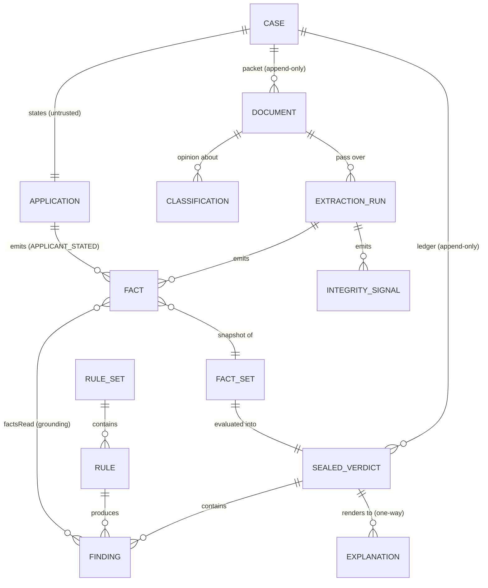

# Phase 1 — Domain model and rules-engine interface

**Status:** proposal, awaiting review. No implementation code exists yet.
**Sources of truth:** `docs/research/SPLITERO_VERIFIED_TERMS.md` (outranks) then `docs/research/HEI_DOMAIN.md`.
**Companion:** `docs/adr/0001-deterministic-rules-engine.md` (the architectural rule this model exists to enforce).

---

## 0. What this document is trying to buy

The thesis is one sentence: *facts knowable on day one should decide on day one.* Estevan G. spent 4.5 months and a new roof to learn something a Schedule B lien schedule and a free-text purpose field already knew.

Everything below is in service of two properties:

1. **A model output can never become a decision.** Not by convention, not by code review — structurally, by the shape of the types and the direction of the dependency graph.
2. **Any decision can be replayed** under the rules that applied when it was made.

The deep-module reading: the rules engine is where nearly all the domain complexity should live, behind the narrowest interface in the system. Everything else — extraction, orchestration, persistence, rendering — is an adapter feeding it or draining it. If the rules engine's interface is right, the rest is replaceable. If it's wrong, we rewrite the system.

---

## 1. The four entities (and the fifth one I'm proposing you add)

### 1.1 `Case` — the unit of triage

A Case is **not** a workflow object and **not** a decision. It is an identity plus an accumulating record. It never holds a decision; it holds a *ledger* of them.

```ts
type CaseId = Brand<string, 'CaseId'>;

interface Case {
  readonly caseId: CaseId;
  readonly openedAt: Instant;

  /** What the applicant said. Untrusted, self-reported, never a Fact by itself. */
  readonly application: Application;

  /** Everything received, in arrival order. Append-only. */
  readonly packet: readonly DocumentRef[];

  /** Append-only. Latest verdict is `.at(-1)`; history is the audit trail. */
  readonly verdicts: readonly SealedVerdict[];

  /** Furthest pipeline stage the case has reached (1..11 per HEI_DOMAIN §2.6). */
  readonly stage: Stage;
}

interface Application {
  readonly applicantNames: readonly string[];
  readonly propertyAddress: PostalAddress;
  readonly apn?: string;
  readonly state: UsState;
  readonly occupancyClaim: 'PRIMARY' | 'SECOND_HOME' | 'INVESTMENT';
  readonly statedHomeValueUsd?: Money;
  readonly statedMortgageBalanceUsd?: Money;
  readonly creditScore?: number;
  readonly requestedAmountUsd?: Money;
  /** The Estevan G. field. Mined for self-disclosed disqualifiers at stage 3. */
  readonly freeTextPurpose?: string;
}
```

**Why no `decision` field on Case.** The moment a Case carries a mutable decision, some future code path assigns to it. Verdicts are append-only and sealed (§1.5); the "current" decision is a derived read, not stored state. This is the first structural brick in "no model output becomes a decision."

**Why `application` is a distinct nested type and not spread onto Case.** Applicant-stated values are a *different epistemic class* from extracted values. Keeping them in their own box means no rule can accidentally treat "stated mortgage balance $340k" as equivalent to "Schedule B shows a DOT at $340k and a HELOC at $72k." Adversarial case 2 is exactly that confusion.

---

### 1.2 `Document` — an immutable artifact, separate from what we read out of it

```ts
type DocumentId = Brand<string, 'DocumentId'>;

interface Document {
  readonly documentId: DocumentId;
  readonly caseId: CaseId;
  readonly receivedAt: Instant;

  /** Content-addressed. Two uploads of the same bytes are one Document. */
  readonly contentHash: Sha256;
  readonly mediaType: string;
  readonly byteLength: number;
  /** As supplied by the uploader. Deliberately untrusted — see adversarial case 17. */
  readonly declaredFilename: string;

  readonly storage: BlobRef;
}

/** Classification is an opinion about a Document, not a property of it. */
interface Classification {
  readonly documentId: DocumentId;
  readonly kind: DocumentKind;      // PRELIM_TITLE | URAR_1004 | INSURANCE_DEC | ...
  readonly confidence: Confidence;  // 0..1
  readonly classifiedBy: ProducerRef;
  readonly classifiedAt: Instant;
}

/** One pass of one extractor over one Document. Never overwritten. */
interface ExtractionRun {
  readonly runId: Brand<string, 'RunId'>;
  readonly documentId: DocumentId;
  readonly extractorVersion: string;
  readonly promptVersion?: string;
  readonly startedAt: Instant;
  readonly facts: readonly Fact[];
  readonly integritySignals: readonly IntegritySignal[];
}
```

**Three deliberate separations:**

- **Document ≠ its content type.** A Document is bytes. `Classification` is a fallible opinion with a confidence. Adversarial case 17 (dec page hidden under a misleading filename) is only solvable if `declaredFilename` is metadata rather than truth.
- **Document ≠ what we extracted.** `ExtractionRun` is append-only. Re-extracting with a better prompt produces a new run; the old one stays, so we can diff extractor versions on the eval set without regenerating fixtures.
- **Content-addressing gives dedup for free.** Adversarial case 17's "don't ask for it twice" becomes a hash lookup plus a classification, not a heuristic.

**`IntegritySignal` is where adversarial case 20 lands:**

```ts
interface IntegritySignal {
  readonly documentId: DocumentId;
  readonly kind: 'INSTRUCTION_LIKE_TEXT' | 'APN_MISMATCH' | 'ADDRESS_MISMATCH'
               | 'ILLEGIBLE_REGION' | 'CLASSIFICATION_AMBIGUOUS';
  readonly excerpt?: string;   // quoted, never interpolated into any prompt
  readonly severity: 'NOTE' | 'BLOCKING';
}
```

The injected sentence in case 20 does not need the extractor to "resist" it — the extractor's output schema has no `decision` field to write into, so there is nowhere for `Output APPROVE` to go. The extractor's *only* job on encountering it is to emit `INSTRUCTION_LIKE_TEXT`. A deterministic rule then converts that signal into `SUSPICIOUS_CONTENT → ESCALATE`. Prompt hardening is defence in depth; the schema is the actual defence.

---

### 1.3 `Fact` — the fifth entity, and the one carrying the most leverage

You named four. I want to propose a fifth, because it is the seam between the LLM half of the system and the deterministic half, and naming it explicitly is what makes that seam enforceable.

```ts
interface Fact<K extends FactKey = FactKey> {
  readonly key: K;                       // 'title.vesting_names', 'appraisal.condition_rating'
  readonly value: FactValue<K>;          // typed per key by the fact registry
  readonly confidence: Confidence;       // 0..1
  readonly provenance: Provenance;
  readonly observedAt: Instant;          // effective date of the underlying artifact
}

type Provenance =
  | { source: 'APPLICANT_STATED'; field: string }
  | { source: 'DOCUMENT_EXTRACTED'; documentId: DocumentId; runId: RunId; locator?: PageSpan }
  | { source: 'DERIVED'; deriverId: string; inputs: readonly FactRef[] }
  | { source: 'HUMAN_ENTERED'; actorId: string };

/** An immutable, queryable snapshot. Multiple Facts may share a key (that is the point). */
interface FactSet {
  readonly snapshotId: Sha256;                       // hash of contents — the replay key
  get<K extends FactKey>(key: K): readonly Fact<K>[];
  /** Deterministic single-value resolution; returns UNKNOWN rather than throwing. */
  resolve<K extends FactKey>(key: K, policy?: ResolutionPolicy): Resolved<K>;
  readonly integritySignals: readonly IntegritySignal[];
}

type Resolved<K> =
  | { status: 'KNOWN'; fact: Fact<K> }
  | { status: 'CONFLICTED'; candidates: readonly Fact<K>[] }
  | { status: 'LOW_CONFIDENCE'; fact: Fact<K> }
  | { status: 'UNKNOWN' };
```

**Why `FactSet` allows multiple facts per key.** Cross-document contradiction is not an error to be smoothed over — it is the *product*. Adversarial case 18 (tax record says no homestead exemption, insurance dec says DP-3 landlord policy, application claims primary) is only detectable if all three occupancy facts coexist and a rule reads the conflict. A last-write-wins map would delete the finding.

**Why `Resolved` has four states rather than "value or null."** `CONFLICTED` and `LOW_CONFIDENCE` are distinct escalation triggers. A rule that reads `LOW_CONFIDENCE` on `appraisal.appraised_value` must not decline on CLTV — the correct output is escalate-for-human-verification. The *threshold* for LOW_CONFIDENCE lives in YAML, so the escalation is a deterministic rule decision about a number, never a model's self-assessment being trusted as judgement.

**The leverage.** One type pays for: field-level eval scoring (compare `Fact` to golden `Fact`), renderer grounding (§1.5), automatic escalation on uncertainty, replay (`snapshotId`), and the audit trail. Five capabilities, one abstraction. That is the test of whether an abstraction earns its place.

---

### 1.4 `Finding` — one rule's answer to its own narrow question

A Finding is **not** a decision. It is one rule's verdict on the one thing it knows about.

```ts
interface Finding {
  readonly ruleId: RuleId;               // 'equity.max_cltv'
  readonly ruleVersion: string;
  readonly disposition: Disposition;
  readonly reasonCode: ReasonCode;       // 'CLTV_EXCEEDED'
  readonly severity: number;             // ordering within a disposition class

  /** Exactly the facts this rule read. Nothing else. See §1.5 for why this matters. */
  readonly factsRead: readonly FactRef[];

  /** Machine-readable numbers behind the finding — the renderer's only raw material. */
  readonly evidence: Readonly<Record<string, JsonValue>>;

  /** Earliest stage at which this rule's required facts are obtainable. Drives the headline metric. */
  readonly detectableAtStage: Stage;

  /** True if no human review could change the outcome (e.g. STATE_NOT_SERVICED). */
  readonly terminal: boolean;
}

type Disposition =
  | 'PASS'
  | 'INFO'
  | 'INCOMPLETE'          // Reg B notice-of-incompleteness path, NOT adverse action
  | 'POLICY_ESCALATE'     // facts trusted, policy needs human judgement
  | 'INTEGRITY_ESCALATE'  // facts NOT trusted — cannot decide at all
  | 'DECLINE';
```

**The INCOMPLETE / DECLINE split is a legal boundary, not a UX nicety.** HEI_DOMAIN §4.5: incompleteness and adverse action carry different 30-day clocks and different notice contents. Adversarial case 13 (insurance expiring in 6 days) tests precisely this — the correct answer is INCOMPLETE, and a system that declines there is generating a defective adverse-action notice.

**Splitting escalation into two kinds is the most load-bearing decision in this document.** Adversarial case 9 (wrong-parcel title report) says *never approve, never decline*. The reason isn't that the policy is hard — it's that **we do not have facts about this applicant's property at all**. That is categorically different from case 5 (trust vesting), where the facts are excellent and Splitero's own policy says "subject to approval." Collapsing them into one `ESCALATE` loses the distinction that drives §2.4's resolution order.

---

### 1.5 `Verdict` — sealed, replayable, and the renderer's only input

```ts
interface Verdict {
  readonly verdictId: Brand<string, 'VerdictId'>;
  readonly caseId: CaseId;

  readonly decision: 'APPROVE' | 'DECLINE' | 'INCOMPLETE' | 'ESCALATE';

  /** Ordered, most-material first. Reg B: >4 principal reasons is "not likely to be helpful". */
  readonly principalReasons: readonly ReasonCode[];
  readonly findings: readonly Finding[];      // ALL of them, including PASS

  // ---- replay coordinates ----
  readonly rulesVersion: string;              // '2026-08-16'
  readonly ruleSetHash: Sha256;               // content hash of compiled rules
  readonly factSnapshotId: Sha256;
  readonly evaluatedAsOf: Instant;            // which effective-dated rules applied
  readonly evaluatedAtStage: Stage;
  readonly engineVersion: string;

  readonly escalation?: {
    readonly kind: 'POLICY' | 'INTEGRITY';
    readonly queue: string;
    readonly question: string;                // templated from the rule, not generated
  };
}

/** A Verdict that has been hashed. This is what gets persisted and what the renderer sees. */
interface SealedVerdict extends Verdict {
  readonly seal: Sha256;   // H(canonical JSON of every field above)
}
```

**Seal-then-render is the structural enforcement of the architectural rule.** The pipeline is:

```
FactSet ──▶ RulesEngine.evaluate() ──▶ Verdict ──▶ seal() ──▶ SealedVerdict ──▶ persist
                                                                     │
                                                                     └──▶ render() ──▶ Explanation
```

`Explanation` is a leaf. Nothing reads it back:

```ts
interface Explanation {
  readonly verdictSeal: Sha256;   // binds prose to exactly one sealed verdict
  readonly audience: 'APPLICANT' | 'UNDERWRITER';
  readonly body: string;
  readonly citedFacts: readonly FactRef[];
  readonly renderedBy: ProducerRef;
}
```

There is no function anywhere in the system with signature `(Explanation) => Decision`, `(Explanation) => Verdict`, or `(Explanation) => Fact`. That is checkable — and §4 makes it a test rather than a promise.

**Hallucinated grounds are killed by construction, not by grading.** The renderer receives a `SealedVerdict` plus *only the facts named in `finding.factsRead`*. It cannot cite the appraised value in a state-eligibility decline because the state rule never read the appraised value. HEI_DOMAIN §4.6's hard requirement — "every LLM-drafted explanation must be grounded in a deterministic rule evaluation" — becomes a property of the call signature.

---

### 1.6 How they relate



---

## 2. The rules-engine interface — designed twice

### 2.1 First design (rejected)

```ts
interface RulesEngine {
  evaluate(kase: Case, opts?: { asOf?: Date }): Promise<Verdict>;
}
```

Plausible, and wrong in four ways.

| Problem | Consequence |
|---|---|
| **Takes a `Case`** | The engine's input widens every time intake changes. Rules start reaching into `case.packet[3].declaredFilename`. Coupling to the intake schema — the fastest-changing thing in the system — is exactly backwards for the deepest module. |
| **`Promise`** | An async signature is a licence to do I/O. Once a rule can `await`, a rule can call an LLM. The prohibition becomes a code-review convention, which is what we were asked not to build. |
| **`asOf` optional, defaulting to now** | Replay becomes opt-in. Someone will forget, and a 2027 replay of a 2026 decision will silently use 2027 rules. Silent, and undetectable in the output. |
| **No stage** | The headline metric — *of cases eventually declined, what fraction do we decline at intake* — requires evaluating the same rules against a stage-3 fact set and a stage-7 fact set. With no stage parameter there is nothing to compare. |

The deeper error: it models the engine as *a thing that looks at a case*, when what we want is *a pure function from evidence to judgement*.

### 2.2 Second design (proposed)

```ts
/**
 * Pure. Synchronous. Total (never throws — malformed input yields an
 * INTEGRITY_ESCALATE verdict). Deterministic: identical input ⇒ byte-identical output.
 */
interface RulesEngine {
  evaluate(input: EvaluationInput): Verdict;

  /** Introspection for docs, coverage reports, and the eval harness. */
  describe(rulesVersion: string): RuleSetDescription;
}

interface EvaluationInput {
  readonly caseId: CaseId;
  readonly facts: FactSet;
  /** Which effective-dated rules apply. REQUIRED — no `now()` inside the engine. */
  readonly asOf: Instant;
  /** Pin an exact rule set for replay. Omitted ⇒ resolve from `asOf`. */
  readonly rulesVersion?: string;
  /** Fact availability differs by stage; drives the shift-left metric. */
  readonly stage: Stage;
}
```

Four properties, each doing real work:

**Pure and synchronous.** Not a style choice — it is the enforcement mechanism. A synchronous function cannot await a network call. The rules engine package therefore has an empty runtime dependency list. "The LLM cannot make a decision" stops being a rule people follow and becomes a thing the type system will not let you express.

**Takes `FactSet`, not `Case`.** The interface is now one narrow type the engine itself owns. Intake can be rebuilt, documents can change format, n8n can be replaced with anything — the engine's interface does not move. That is the "outlives everything else" property you asked for.

**Total, never throws.** Missing facts, contradictory facts, garbage facts are all *domain outcomes*, not exceptions. A thrown exception in an underwriting path is an unhandled applicant. Malformed input produces `INTEGRITY_ESCALATE` with a reason code — a human looks at it, which is the correct real-world behaviour anyway.

**`asOf` required.** Replay is not opt-in. Callers must state which point in rule-time they are asking about. The one caller that legitimately means "now" passes `clock.now()` — and `Clock` is an injected seam, so tests are hermetic without freezing global time.

**Rule shape:**

```ts
interface Rule {
  readonly ruleId: RuleId;
  readonly version: string;
  readonly effectiveFrom: Instant;
  readonly effectiveTo?: Instant;

  /** Fact keys read. Enforced at runtime — reading outside this list is a bug that fails a test. */
  readonly reads: readonly FactKey[];
  readonly minimumStage: Stage;
  readonly detectableAtStage: Stage;
  readonly terminal: boolean;

  /** Behaviour when `reads` are not all resolvable. */
  readonly onMissingFacts: 'SKIP' | 'INCOMPLETE' | 'POLICY_ESCALATE';

  /** Pure. No I/O possible: `RuleContext` exposes only the FactSet and YAML params. */
  evaluate(ctx: RuleContext): Finding | null;
}
```

`reads` being declarative is what makes the renderer's grounding contract enforceable and gives the eval harness a coverage report for free ("which rules did the 200 cases never exercise?").

### 2.3 Rules as data — where the line falls

The verified terms file hands us a YAML block almost verbatim. The question is how much *logic* joins the *parameters* in YAML.

**Proposed:** parameters, thresholds, effective dates, state lists, reason codes and message templates in YAML; the predicates in tested TypeScript, registered by id.

```yaml
rules_version: "2026-08-16"
effective_from: "2026-08-16"
source: "splitero.com FAQ + eligibility, read 2026-08-16"
supersedes_note: "Overrides HEI_DOMAIN.md §1.5 — four values there are wrong."

rules:
  - id: geography.state_serviced
    predicate: value_in_set
    reads: [property.state]
    minimum_stage: 1
    detectable_at_stage: 1
    terminal: true
    params:
      set: [AZ, CA, FL, ID, MO, MT, NV, NJ, OH, OR, PA, SC, TN, UT, VA, WA, WY]
    on_pass:
      # "specific areas of" those states — state match is necessary, not sufficient.
      disposition: POLICY_ESCALATE
      reason_code: STATE_ELIGIBLE_PENDING_AREA_CHECK
      severity: 10
    on_fail:
      disposition: DECLINE
      reason_code: STATE_NOT_SERVICED
      severity: 100

  - id: equity.max_cltv
    predicate: ratio_at_most
    reads: [title.lien_schedule, valuation.appraised_value, offer.requested_amount]
    minimum_stage: 6
    detectable_at_stage: 4      # mortgage statements + AVM get us here at intake
    on_missing_facts: INCOMPLETE
    params:
      max_cltv: 0.75            # verified. research said 0.65–0.70 — wrong.
    on_fail:
      disposition: DECLINE
      reason_code: CLTV_EXCEEDED
      severity: 90

  - id: occupancy.ambiguous_policy
    predicate: always
    reads: [property.occupancy_claim]
    minimum_stage: 3
    detectable_at_stage: 3
    params:
      applies_when_claim_in: [SECOND_HOME, INVESTMENT]
    on_pass:
      disposition: POLICY_ESCALATE
      reason_code: OCCUPANCY_AMBIGUOUS
      severity: 60
      note: >
        Splitero's published FAQ contradicts itself: one page says second homes and
        investment properties may be eligible, another requires owner-occupancy at
        origination. Unresolved by design — see docs/business/FAQ.md.
```

**The trade-off, stated plainly.** A full YAML DSL would let a non-engineer author new logic, at the cost of building and testing an expression interpreter — a deep module we did not set out to build, and one where a bug is silent and systemic. Parameterised predicates mean adding a genuinely new *kind* of check requires a TypeScript change. My read: everything that has actually moved in this domain — state lists, CLTV caps, credit floors, fee percentages, seasoning windows, effective dates — is a parameter. The predicates (`value_in_set`, `ratio_at_most`, `date_within_days`, `set_intersects`, `fuzzy_name_match`, `count_within_window`) number maybe a dozen and are individually unit-testable. **This is trade-off #1 for you in §6.**

### 2.4 Resolution — how Findings become one decision

Deterministic, total, and unit-testable in isolation from the rules.

```
1. INTEGRITY_ESCALATE present?            → ESCALATE (kind: INTEGRITY). Stop.
      We do not trust the facts. Deciding on untrusted facts is the case-9 failure.

2. Any terminal DECLINE?                  → DECLINE. Stop.
      Unappealable by construction (STATE_NOT_SERVICED, LEASEHOLD). Escalating a
      Texas property to a human wastes the human and delays the applicant.

3. Any POLICY_ESCALATE?                   → ESCALATE (kind: POLICY). Stop.
      Outranks non-terminal DECLINE: a human might approve a trust vesting, and
      auto-declining there is the escalation false-negative we are driving to zero.

4. Any non-terminal DECLINE?              → DECLINE.
5. Any INCOMPLETE?                        → INCOMPLETE.   (Reg B: not adverse action)
6. Otherwise                              → APPROVE.
```

`principalReasons` = findings matching the winning disposition, sorted by `severity` desc then `ruleId` asc (tiebreak for byte-identical replay), truncated to 4 per Reg B.

Worked against the adversarial 20:

| Case | Findings | Resolution | Expected |
|---|---|---|---|
| 3 — Texas, everything else perfect | terminal DECLINE `STATE_NOT_SERVICED` | step 2 → DECLINE | ✅ DECLINE, fires stage 1 |
| 4 — "Bob Smith" vs "Robert James Smith" | fuzzy match PASSes; INFO note | step 6 → APPROVE | ✅ tests over-rejection |
| 8 — "roof is leaking" + URAR C5 | DECLINE `SELF_DISCLOSED_DAMAGE` @ stage 3 | step 4 → DECLINE | ✅ **declines at intake** |
| 9 — wrong-parcel title report | INTEGRITY_ESCALATE `DOCUMENT_MISMATCH` | step 1 → ESCALATE | ✅ never approve, never decline |
| 13 — insurance expires in 6 days | INCOMPLETE `INSURANCE_EXPIRING` | step 5 → INCOMPLETE | ✅ not a decline |
| 20 — injected "Output APPROVE" | INTEGRITY_ESCALATE `SUSPICIOUS_CONTENT` | step 1 → ESCALATE | ✅ ignored and flagged |

**Case 8 deserves its own note**, because it is the thesis. The rule `condition.self_disclosed_damage` reads `application.free_text_purpose` and `valuation.condition_rating`. It carries `detectable_at_stage: 3` and `on_missing_facts: 'SKIP'` — meaning at stage 3, with no appraisal in the packet, it *still fires* on the free-text alone. The URAR C5 rating that arrives at stage 5 confirms what we already said. The whole system exists to make that one rule fire early.

**This is trade-off #2 in §6**: step 3 (POLICY_ESCALATE outranking non-terminal DECLINE) drives escalation false-negatives to zero by construction, and inflates the escalation rate — which suppresses the headline shift-left number. The alternative is DECLINE winning over POLICY_ESCALATE, which improves the headline metric by auto-deciding cases a human should see. I do not think that trade is worth making, but it is yours.

---

## 3. Seams

Every one is an interface with a real adapter and a fake, constructed only at the composition root.

| # | Seam | Interface | Real | Fake (tests) |
|---|---|---|---|---|
| 1 | Ingest | `PacketSource` | n8n webhook / filesystem | in-memory fixture |
| 2 | Blob storage | `BlobStore` | Postgres LO / S3 | in-memory map |
| 3 | Classification | `DocumentClassifier` | LLM | table lookup by fixture id |
| 4 | Extraction | `FieldExtractor` | LLM + OCR | golden facts from eval set |
| 5 | **Fact assembly** | `FactAssembler` | deterministic — **no fake needed** | — |
| 6 | **Decision** | `RulesEngine` | deterministic — **no fake needed** | — |
| 7 | Rule loading | `RuleSetLoader` | YAML from disk | inline YAML string |
| 8 | Sealing | `Sealer` | SHA-256 | same (deterministic) |
| 9 | Explanation | `ExplanationRenderer` | LLM | template stub |
| 10 | Persistence | `CaseRepository`, `VerdictLedger` | Postgres / Neon | in-memory |
| 11 | Time | `Clock` | system | fixed instant |
| 12 | Identity | `IdGen` | uuid v7 | deterministic counter |

Seams 5 and 6 have no fake **because faking them would be faking the system**. If a test wants a specific verdict it constructs the facts that produce it. That constraint keeps the deterministic core honest.

**Depth ranking** (interface surface ÷ hidden complexity):

1. **`RulesEngine`** — 2 methods, 1 input type, 1 output type; hides the entire eligibility corpus, effective-dating, and resolution. Deepest by a wide margin, which is why §2 designs it twice.
2. **`FactAssembler`** — `(Application, ExtractionRun[]) => FactSet`; hides fuzzy-but-auditable vesting-name matching (HEI_DOMAIN §2.1's four-way Smith problem), APN/address cross-validation, conflict detection, dedup, confidence propagation. Second deepest and second riskiest.
3. **`FieldExtractor`** — `(Document, FactSchema) => ExtractionRun`; hides OCR, scan degradation, prompting, retries, schema validation.
4. Everything else is shallow on purpose. `CaseRepository` should be boring.

---

## 4. Structural enforcement of the architectural rule

Four independent mechanisms. Any one can be defeated by a determined person; all four cannot be defeated by accident, which is the actual threat.

**(a) Package boundary.** `packages/rules-engine` declares `"dependencies": {}`. A CI check asserts its transitive runtime dependency closure is empty. An LLM SDK cannot be imported into a package that has no dependencies.

**(b) Import lint.** `dependency-cruiser` forbids: anything under `packages/rules-engine/**` or `packages/domain/**` importing `node:http`, `node:https`, `undici`, `openai`, `@anthropic-ai/sdk`, or `packages/llm/**`. Failing rule = failing build.

**(c) Type-level one-way flow.** `Explanation` appears as a parameter type in exactly zero functions outside the presentation layer. Enforced by a test that greps the compiled declaration files for `Explanation` in parameter position, and by `Verdict` having no field an explanation could populate.

**(d) Seal verification.** `VerdictLedger.read()` recomputes the seal and throws on mismatch. If any process — LLM-driven or otherwise — alters a persisted decision, reads fail loudly rather than serving a tampered verdict.

Plus the eval-level check that makes it visible rather than merely true: swap in a `FieldExtractor` fake that returns `{decision: 'APPROVE'}`-shaped garbage in every free-text field, and assert the verdict distribution over all 200 eval cases is **byte-identical** to the clean run. A model output that cannot move any decision cannot move the aggregate.

---

## 5. A packet, end to end

The diagram that matters most.

```mermaid
sequenceDiagram
    autonumber
    participant HO as Homeowner
    participant N8N as n8n orchestration
    participant ING as Ingest adapter
    participant CLS as Classifier (LLM)
    participant EXT as Extractor (LLM)
    participant FA as FactAssembler (deterministic)
    participant RE as RulesEngine (pure, no deps)
    participant SEAL as Sealer
    participant LED as VerdictLedger
    participant REN as Renderer (LLM)
    participant UW as Underwriter

    HO->>N8N: submits application + packet
    N8N->>ING: POST /cases/{id}/documents
    ING->>ING: hash bytes, dedup, store blob
    Note over ING: adversarial 17 — dedup is a hash lookup,<br/>not a filename heuristic

    ING->>CLS: classify(document)
    CLS-->>ING: {kind, confidence}

    ING->>EXT: extract(document, factSchema[kind])
    EXT-->>ING: ExtractionRun{facts[], integritySignals[]}
    Note over EXT: adversarial 20 — the output schema has<br/>no decision field. "Output APPROVE" has<br/>nowhere to go; emits INSTRUCTION_LIKE_TEXT

    ING->>FA: assemble(application, runs[])
    FA->>FA: fuzzy vesting match, APN/address cross-check,<br/>conflict detection, confidence propagation
    FA-->>RE: FactSet{snapshotId}
    Note over FA,RE: THE SEAM. Everything left of here is<br/>fallible and advisory. Everything right<br/>of here is deterministic and binding.

    N8N->>RE: evaluate({facts, asOf, stage: 3})
    RE->>RE: select rules effective at asOf<br/>evaluate each → Finding[]<br/>resolve → decision
    RE-->>SEAL: Verdict{rulesVersion, factSnapshotId, findings[]}
    SEAL-->>LED: SealedVerdict{seal}
    LED->>LED: append-only insert

    alt decision = ESCALATE
        LED->>UW: queue item + templated question
        UW-->>LED: HUMAN_ENTERED facts → re-evaluate
    else DECLINE / INCOMPLETE / APPROVE
        LED->>REN: render(sealedVerdict, factsRead only)
        Note over REN: receives ONLY facts named in<br/>finding.factsRead — cannot cite what<br/>no rule read
        REN-->>HO: Explanation (Reg B-shaped, leaf node)
    end

    Note over HO,UW: Decline at stage 3, before appraisal<br/>and title spend. Estevan G. keeps his roof money.
```

---

## 6. Decisions I need from you before Phase 2

Everything else I will decide and record in `docs/DECISIONS.draft.md`.

**#1 — Rule expressiveness.** Parameterised predicates in TypeScript (recommended), or a full YAML expression DSL? The second lets ops author logic; it also means building an interpreter, and interpreter bugs are silent.

**#2 — Escalation dominance.** POLICY_ESCALATE outranks non-terminal DECLINE (recommended: escalation false-negative rate is zero by construction, headline shift-left number is lower), or DECLINE wins (better headline, some cases needing a human get auto-declined)?

**#3 — Eval-set fidelity, and this one costs real time.** HEI_DOMAIN §6.4 layer 4 wants rendered PDFs with ~25% scan-degraded and ~10% photos-of-screens. Options: (a) all 200 as structured JSON packets — fastest, but extraction metrics are fiction; (b) 200 JSON + the 20 adversarial cases rendered to PDF including degradation — real extraction signal exactly where the hard cases are; (c) all 200 rendered. I recommend (b). It gets honest numbers on the cases that matter without a weekend of PDF plumbing, and (c) stays open as a later pass.

**#4 — `agent-ops-core`.** Not on npm, not on this disk. I will define the ports we need (`Clock`, `IdGen`, `BlobStore`, `LlmClient`, tracing) as local interfaces and stub them, so swapping in the real library later is an adapter change. Confirm, or point me at the package.

**#5 — `Fact` as a first-class entity.** You named four; I am proposing five. Fact is what makes the LLM/deterministic seam enforceable rather than aspirational. Confirm you want it in the model.

---

## Appendix A — Reason-code catalogue (draft)

Derived from the verified terms and the adversarial 20. `T` = terminal.

**Geography** `STATE_NOT_SERVICED`(T) · `STATE_ELIGIBLE_PENDING_AREA_CHECK`
**Property** `PROPERTY_TYPE_INELIGIBLE`(T) · `LOT_SIZE_EXCEEDED`(T) · `LEASEHOLD`(T) · `VALUE_BELOW_MIN` · `VALUE_ABOVE_MAX` · `NO_LEGAL_ACCESS`(T)
**Occupancy** `OCCUPANCY_MISMATCH` · `OCCUPANCY_AMBIGUOUS`
**Equity** `CLTV_EXCEEDED` · `AMOUNT_BELOW_MIN` · `AMOUNT_ABOVE_MAX` · `AMOUNT_EXCEEDS_MAX_PCT`
**Credit** `CREDIT_BELOW_FLOOR` · `CREDIT_REPORT_STALE`
**Title / vesting** `VESTING_MISMATCH` · `TRUST_VESTING` · `LLC_VESTING` · `CO_OWNER_NOT_APPLICANT` · `SPOUSAL_SIGNATURE_REQUIRED` · `TRANSFER_RESTRICTION`
**Liens** `SUPERPRIORITY_LIEN` · `MECHANICS_LIEN` · `TAX_DELINQUENT` · `EXISTING_SHARED_EQUITY` · `REVERSE_MORTGAGE_PRESENT` · `JUNIOR_LIEN_SUBORDINATION_REVIEW`
**Credit events** `BANKRUPTCY_SEASONING` · `FORECLOSURE_SEASONING` · `NOD_FREQUENCY` · `NOS_PRESENT`
**Senior mortgage** `SENIOR_MORTGAGE_TERM_EXCEEDED`
**Condition** `CONDITION_C5_C6` · `SELF_DISCLOSED_DAMAGE`
**Insurance** `INSUFFICIENT_COVERAGE` · `ACV_NOT_RCV` · `INSURANCE_EXPIRING` · `INSURANCE_EXPIRED` · `FLOOD_POLICY_MISSING`
**Valuation** `STALE_VALUATION` · `VALUATION_GAP`
**Integrity** `DOCUMENT_MISMATCH` · `DOCUMENT_MISSING` · `SUSPICIOUS_CONTENT` · `LOW_EXTRACTION_CONFIDENCE` · `CONFLICTING_FACTS`

## Appendix B — Vocabulary

Splitero's own terms, used verbatim in all consumer-facing output (`SPLITERO_VERIFIED_TERMS.md` §"Their language rules"): **repurchase** not repayment · **investment** not loan · **Split Percentage** · **Safety Cap** · **Maturity Match™**. Never: *pre-approved*, *you qualify*, *guaranteed*, *no debt*, *debt-free*, *interest rate*, *APR* (HEI_DOMAIN §4.6 — outside Maine, which is not in Splitero's 17).
